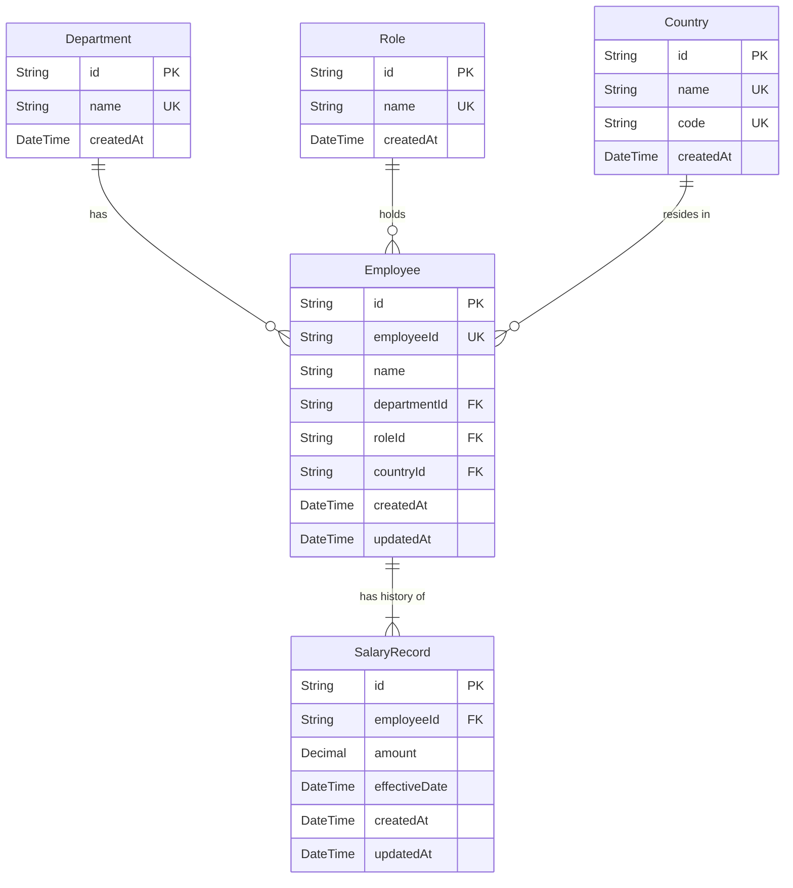

# Schema Design for ACME Salary Management System (Approved)

The goal of this design is to create a normalized, scalable database schema for the ACME Salary Management System. The application must support **10,000+ employees**, provide fast search/filtering, and maintain a complete audit trail of salary changes with effective dates.

---

## User Decisions & Architecture

> [!NOTE]
> **1. Handling of "Current Salary" (Option A):**
> The current salary is defined as the record with `effectiveDate <= CURRENT_DATE` that has the latest (maximum) `effectiveDate`. To support fast dynamic retrieval for 10,000+ employees without caching/denormalization overhead, a composite index `@@index([employeeId, effectiveDate(sort: Desc)])` will be placed on the `SalaryRecord` table.
>
> **2. Single Salary Rate per Effective Date:**
> We enforce that an employee can have at most one salary rate per day. This is guaranteed by a database-level unique constraint: `@@unique([employeeId, effectiveDate])`.
>
> **3. Country Code Integration:**
> The `Country` entity will include both a descriptive name and a unique country code (e.g., ISO 2-letter code like "US", "IN") to improve data standardisation and integration.
>
> **4. Normalization of Metadata (Lookup Tables):**
> `Department`, `Role`, and `Country` are modeled as separate tables to prevent typos, optimize indexing, and standardize filters.

---

## Proposed Changes

### Database Schema Design

The approved entity relationship model:

#### Indexing Strategy for Performance (10,000+ Employees)
1. **Employee Search & Filtering:**
   * Index on `Employee(name)` for search by name.
   * Unique index on `Employee(employeeId)` (automatic) for search by ID.
   * Indexes on `Employee(departmentId)`, `Employee(roleId)`, and `Employee(countryId)` to optimize filtering.
2. **Salary History & Current Salary Queries:**
   * Composite index on `SalaryRecord(employeeId, effectiveDate DESC)` to fetch the active or historical salary records of any employee instantly.
3. **Analytics Queries:**
   * Indexes on reference tables (`Department`, `Country`) are automatically generated for their primary keys. Joining with `Employee` and group-by operations will be highly efficient.

---

### Backend Components

#### [MODIFY] [schema.prisma]

Update the schema to define the models:
* `Department`
* `Role`
* `Country`
* `Employee`
* `SalaryRecord` (representing salary history and audit trail)

---

## Verification Plan

### Automated Tests
1. **Prisma Schema Validation:**
   Run `npx prisma validate` to ensure the schema has no syntax or relation errors.
2. **Database Migration and Generation:**
   Run `npx prisma db push` or `npx prisma migrate dev` to create the SQLite database and generate the Prisma Client.
3. **Seeding Validation (Optional but recommended):**
   Create a small seed script to insert mock data and verify query performance for:
   * Pagination and filtering.
   * Search by name/ID.
   * Average salary by department/country.
   * Monthly salary band distribution.

### Manual Verification
* Inspect the generated client to ensure all relations work as expected.
